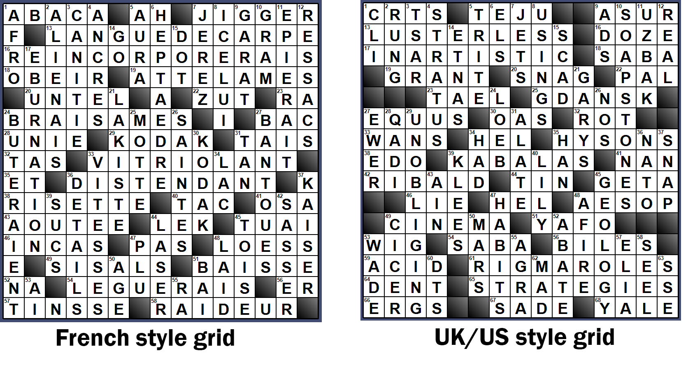

# Wizium

This project is a *crosswords generator engine* able to generate grids from dictonaries, as depicted below. The generator is very fast and can work with initial constraints like fixed black boxes pattern or words already in place on the grid.



The engine comes as a library written in C++. A python wrapper is available right now, other languages may be easily added.


## How to compile the library

If you are on Windows and do not want to compile the library, you can simply use the pre-generated one available [here](./Binaries/Windows/libWizium_x64.dll) and skip this step. Otherwise, any C++ compiler should fit your needs. Currently it has been tested with Visual Studio on Windows and GCC on Linux.

* The [CMakelists.txt](./Sources/CMakeLists.txt) file in the source directory let you use [CMake](https://cmake.org/) for the generation on any platform.
* On Windows, you can find Visual Studio projects in the [Projects](./Projects/) directory.

### Compile on Windows with Visual Studio

Assuming Visual Studio is installed on your machine,

* Launch the "Developer Command Prompt" from the start menu;
* Run the command: ```msbuild ./Projects/VS2017/libWizium.vcxproj -p:Configuration=Release -p:Platform=x64```;
* The DLL should be created in the ```./Binaries/Windows``` directory.

### Compile with CMake on Windows

Assuming CMake and Visual Studio are installed on your machine,

* Step in ```cmake``` directory
* Run the command ```cmake -DCMAKE_GENERATOR_PLATFORM=x64 ..\Sources\```
* Run the command ```cmake --build . --config Release --target install```
* The DLL should be created in the ```./Binaries/Windows``` directory.
  
### Compile with CMake on Linux

Assuming CMake in installed on your machine,

* Step in ```cmake``` directory
* Run the command ```cmake ../Sources/```
* Run the command ```make```
* Run the command ```make install```
* The SO should be created in the ```./Binaries/Linux``` directory.


## Wrappers

### C
The library API is declared in the file [libWizium.h](./Sources/libWizium.h).

It contains the following functions:

* **WIZ_Init:** Initialize the library;
* **WIZ_CreateInstance:** Create a new independent module;
* **WIZ_DestroyInstance:** Destroy a module;
* **DIC_Clear:** Flush the dictionary content;
* **DIC_AddEntries:** Add entries to the dictionary;
* **DIC_FindRandomEntry:** Find a random entry in the dictionary, matching a mask;
* **DIC_FindEntry:** Find a random entry in the dictionary, matching a mask;
* **DIC_GetNumWords:** Return the number of words in the dictionary;
* **GRID_Erase:** Erase the grid content;
* **GRID_SetSize:** Set the grid size. Content can be lost when shrinking;
* **GRID_SetBox:** Set the type of box at a given grid coordinate;
* **GRID_Write:** Write a word on the grid;
* **GRID_Read:** Read the whole content of the grid;
* **SOLVER_Start:** Start the grid generation process;
* **SOLVER_Step:** Move a few steps in the grid generation process;
* **SOLVER_Stop:** Stop the grid generation process;

### Python

[libWizium.py](./Wrappers/Python/libWizium.py) is a Python wrapper giving full access to the engine capabilities. A Wizium module instance can be created through the *Wizium* class, provided the path to the *libWizium* library file. Except for the initialization that is handled automatically, there is a 1-to-1 correspondance between this class functions and the their equivalents in C.

This class provides the following API:

* **dic_clear:** Flush the dictionary content;
* **dic_add_entries:** Add entries to the dictionary;
* **dic_find_random_entry:** Find a random entry in the dictionary, matching a mask;
* **dic_find_entry:** Find a random entry in the dictionary, matching a mask;
* **dic_gen_num_words:** Return the number of words in the dictionary;
* **grid_erase:** Erase the grid content;
* **grid_set_size:** Set the grid size. Content can be lost when shrinking;
* **grid_set_box:** Set the type of box at a given grid coordinate;
* **grid_write:** Write a word on the grid;
* **grid_read:** Read the whole content of the grid;
* **solver_start:** Start the grid generation process;
* **solver_step:** Move a few steps in the grid generation process;
* **solver_stop:** Stop the grid generation process;

The general philosophy consists in 

1. Fill in the dictionary with any list of words;
2. Setup the grid canvas: size, holes, black boxes, imposed words;
3. Use the solver to complete the grid;

A functional out of the box example is provided in [testWizium.py](./Wrappers/Python/testWizium.py).

